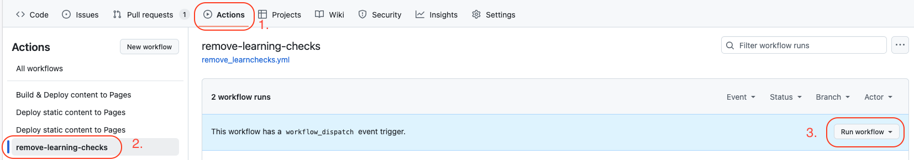

# Deployment

Every commit to `main` gets built and deployed using [build.yml](./.github/workflows/build.yml). R package builds are cached on GitHub and deployment currently takes ~7 minutes until the website is live.
If additional R packages are required add them to [r-packages.nix](./r-packages.nix) replacing all `.` in packages names with `_` (i.e., `data.table` would be `data_table`). All packages on CRAN and BioConductor are available by default. If a package needs to be installed from GitHub see [FRAN](https://github.com/dwinkler1/fran) and possibly add it as an input to [flake.nix](./flake.nix) which defines the build system. An example standalone addition would be: 

```nix
(prev.rPackages.buildRPackage {
          name = "synthdid";
          src = prev.fetchFromGitHub {
            owner = "synth-inference";
            repo = "synthdid";
            rev = "70c1ce3eac58e28c30b67435ca377bb48baa9b8a";
            sha256 = "sha256-rxQqnpKWy4d9ZykRxfILu1lyT6Z3x++gFdC3sbm++pk=";
          };
          propagatedBuildInputs = [prev.rPackages.mvtnorm]; # see Imports in DESCRIPTION file
        };)
```

where `rev` is the commit reference and `sha256` is the hash of the repository at that commit. Leaving `sha256` empty will generate an error displaying the correct hash (also see [nix-prefetch-github](https://github.com/seppeljordan/nix-prefetch-github)). The `propagatedBuildInputs` correspond to the [Imports in the DESCRIPTION file of a package](https://github.com/synth-inference/synthdid/blob/70c1ce3eac58e28c30b67435ca377bb48baa9b8a/DESCRIPTION#L15).

# New Semester

On the 1st of September every year automated pull requests are triggered:

- R gets updated using [update.yml](./.github/workflows/update.yml)
- Learning checks are removed using [remove_learnchecks.yml](./.github/workflows/remove_learnchecks.yml)

These can also be triggered manually under "Actions":


