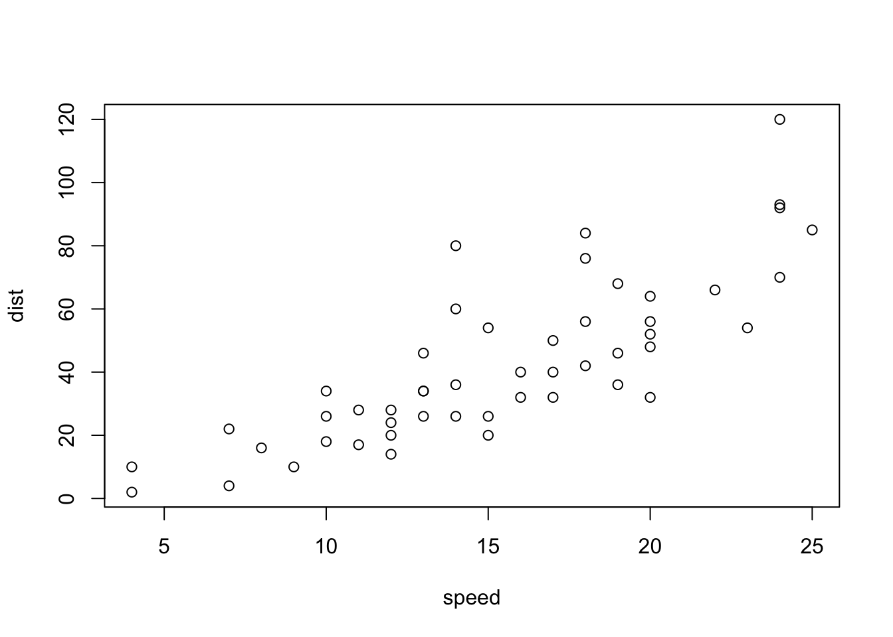
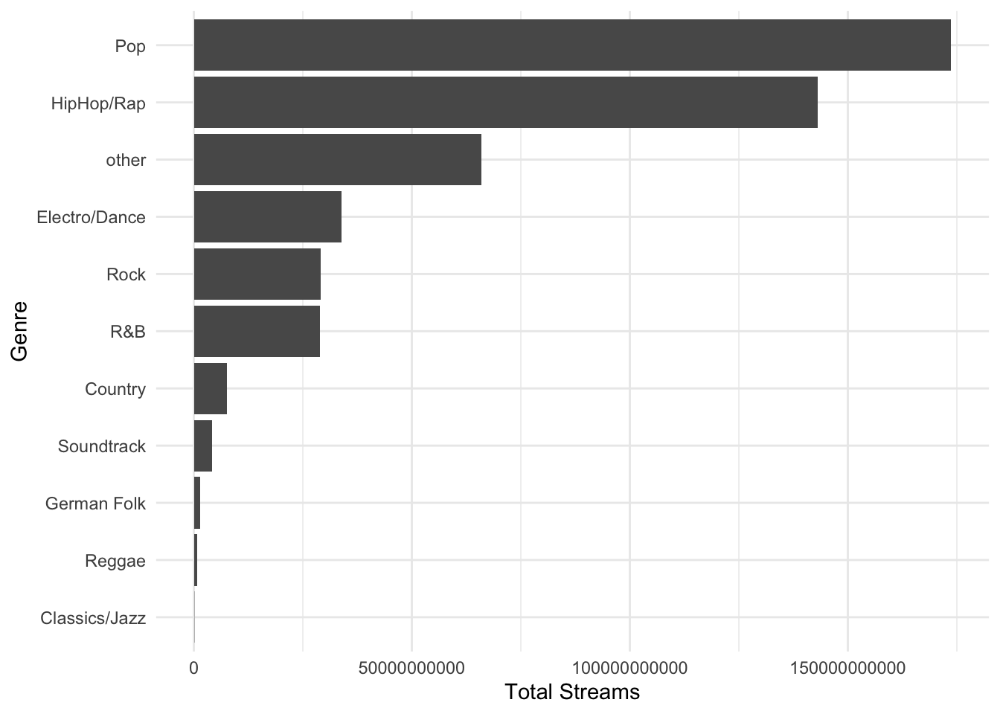
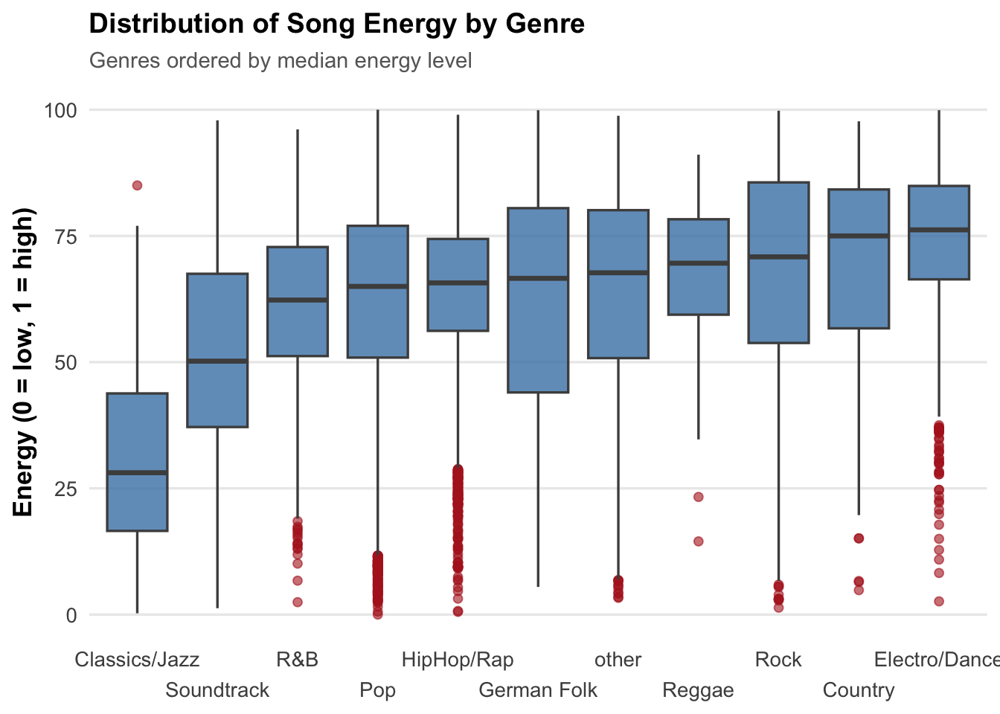
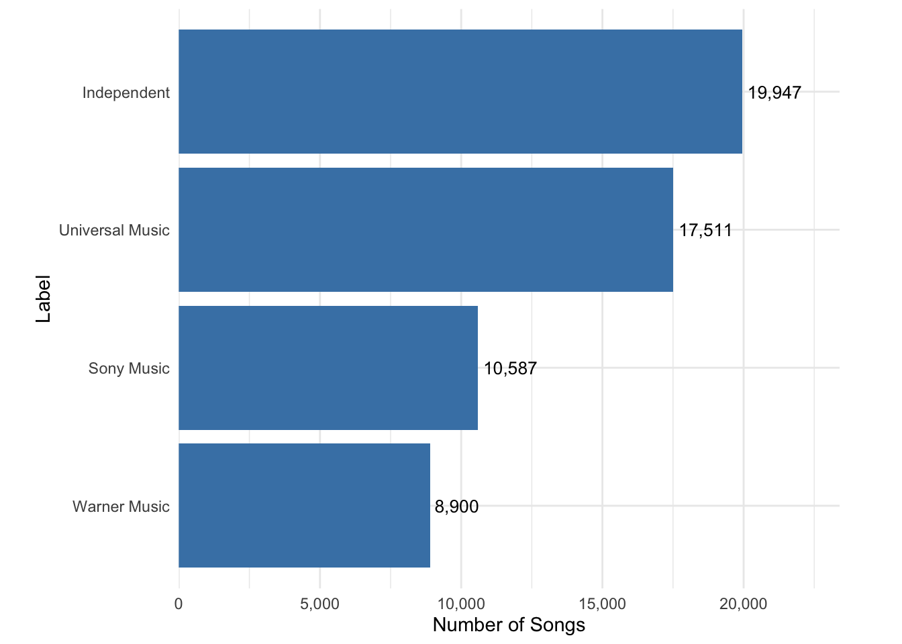
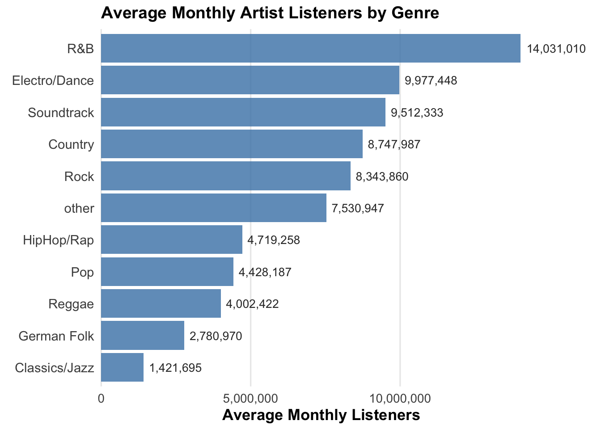
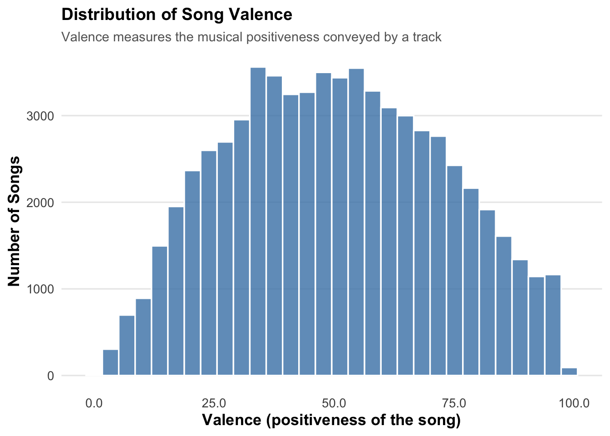
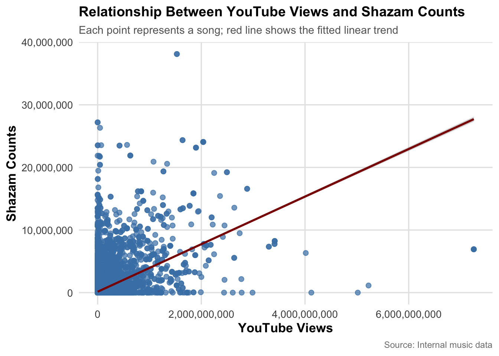

# (PART) Assignments {-}

# Assignments


## R Markdown

::: {.infobox .download data-latex="{download}"}
[You can download the example markdown file here](./Code/rmarkdown_example.Rmd)
:::

This page will guide you through creating and editing R Markdown documents. This is a useful tool for reporting your analysis (e.g. for homework assignments). Of course, there is also [a cheat sheet for R-Markdown](https://www.rstudio.org/links/r_markdown_cheat_sheet) and [this book](https://bookdown.org/yihui/rmarkdown/) contains a comprehensive discussion of the format. 

The following video contains a short introduction to the R Markdown format.

<br>
<div align="center">
<iframe width="560" height="315" src="https://www.youtube.com/embed/o8FdyMAR-g4" frameborder="0" allowfullscreen></iframe>
</div>
<br>

### Creating a new R Markdown document {-}

In addition to the video, the following text contains a short description of the most important formatting options.  

Let's start to go through the steps of creating and .Rmd file and outputting the content to an HTML file. 

0. If an R-Markdown file was provided to you, open it with R-Studio and skip to [step 4](#step4) after adding your answers.

1. Open R-Studio

2. Create a new R-Markdown document


3. Save with appropriate name


    3.1. Add your answers

    3.2. Save again

 <a name="step4"></a>
 
4. "Knit" to HTML 


5. Hand in appropriate file (ending in `.html`) on learn\@WU


### Text and Equations {-}

R-Markdown documents are plain text files that include both text and R-code. Using RStudio they can be converted ('knitted') to HTML or PDF files that include both the text and the results of the R-code. In fact this website is written using R-Markdown and RStudio. In order for RStudio to be able to interpret the document you have to use certain characters or combinations of characters when formatting text and including R-code to be evaluated. By default the document starts with the options for the text part. You can change the title, date, author and a few more advanced options. 


The default is text mode, meaning that lines in an Rmd document will be interpreted as text, unless specified otherwise.

#### Headings {-}

Usually you want to include some kind of heading to structure your text. A heading is created using `#` signs. A single `#` creates a first level heading, two `##` a second level and so on. 


It is important to note here that the ```#``` symbol means something different within the code chunks as opposed to outside of them. If you continue to put a ```#``` in front of all your regular text, it will all be interpreted as a first level heading, making your text very large.

#### Lists {-}

Bullet point lists are created using `*`, `+` or `-`. Sub-items are created by indenting the item using 4 spaces or 2 tabs. 

````
* First Item
* Second Item
    + first sub-item
        - first sub-sub-item
    + second sub-item
````
* First Item
* Second Item
    + first sub-item
        - first sub-sub-item
    + second sub-item


Ordered lists can be created using numbers and letters. If you need sub-sub-items use `A)` instead of `A.` on the third level. 

````
1. First item
    a. first sub-item
        A) first sub-sub-item 
     b. second sub-item
2. Second item
````

1. First item
    a. first sub-item
        A) first sub-sub-item
    b. second sub-item
2. Second item


#### Text formatting {-}

Text can be formatted in *italics* (`*italics*`) or **bold** (`**bold**`). In addition, you can ad block quotes with `>`

````
> Lorem ipsum dolor amet chillwave lomo ramps, four loko green juice messenger bag raclette forage offal shoreditch chartreuse austin. Slow-carb poutine meggings swag blog, pop-up salvia taxidermy bushwick freegan ugh poke.
````
> Lorem ipsum dolor amet chillwave lomo ramps, four loko green juice messenger bag raclette forage offal shoreditch chartreuse austin. Slow-carb poutine meggings swag blog, pop-up salvia taxidermy bushwick freegan ugh poke.

### R-Code {-}

R-code is contained in so called "chunks". These chunks always start with three backticks and ```r``` in curly braces (``` ```{r} ```) and end with three backticks (``` ``` ```). Optionally, parameters can be added after the ```r``` to influence how a chunk behaves. Additionally, you can also give each chunk a name. Note that these have to be **unique**, otherwise R will refuse to knit your document.

#### Global and chunk options {-}

The first chunk always looks as follows


    ```{r setup, include = FALSE}
    knitr::opts_chunk$set(echo = TRUE)
    ```

It is added to the document automatically and sets options for all the following chunks. These options can be overwritten on a per-chunk basis. 

Keep `knitr::opts_chunk$set(echo = TRUE)` to print your code to the document you will hand in. Changing it to `knitr::opts_chunk$set(echo = FALSE)` will not print your code by default. This can be changed on a per-chunk basis.


    ```{r cars, echo = FALSE}
    summary(cars)

    plot(dist~speed, cars)
    ```


```
##      speed           dist       
##  Min.   : 4.0   Min.   :  2.00  
##  1st Qu.:12.0   1st Qu.: 26.00  
##  Median :15.0   Median : 36.00  
##  Mean   :15.4   Mean   : 42.98  
##  3rd Qu.:19.0   3rd Qu.: 56.00  
##  Max.   :25.0   Max.   :120.00
```


 
    ```{r cars2, echo = TRUE}
    summary(cars)

    plot(dist~speed, cars)
    ```


``` r
summary(cars)
```

```
##      speed           dist       
##  Min.   : 4.0   Min.   :  2.00  
##  1st Qu.:12.0   1st Qu.: 26.00  
##  Median :15.0   Median : 36.00  
##  Mean   :15.4   Mean   : 42.98  
##  3rd Qu.:19.0   3rd Qu.: 56.00  
##  Max.   :25.0   Max.   :120.00
```

``` r
plot(dist ~ speed, cars)
```



A good overview of all available global/chunk options can be found [here](https://yihui.name/knitr/options/#chunk_options).

### LaTeX Math {-}

Writing well formatted mathematical formulas is done the same way as in [LaTeX](https://en.wikipedia.org/wiki/LaTeX). Math mode is started and ended using `$$`. 
````
$$
 f_1(\omega) = \frac{\sigma^2}{2 \pi},\ \omega \in[-\pi, \pi]
$$
````

$$
 f_1(\omega) = \frac{\sigma^2}{2 \pi},\ \omega \in[-\pi, \pi]
$$

(for those interested this is the spectral density of [white noise](https://en.wikipedia.org/wiki/White_noise))

Including inline mathematical notation is done with a single ```$``` symbol. 

````
${2\over3}$ of my code is inline.

````
${2\over3}$ of my code is inline.

<br>

Take a look at [this wikibook on Mathematics in LaTeX](https://en.wikibooks.org/wiki/LaTeX/Mathematics#Symbols) and [this list of Greek letters and mathematical symbols](https://www.sharelatex.com/learn/List_of_Greek_letters_and_math_symbols) if you are not familiar with LaTeX.

In order to write multi-line equations in the same math environment, use `\\` after every line. In order to insert a space use a single `\`. To render text inside a math environment use `\text{here is the text}`. In order to align equations start with `\begin{align}` and place an `&` in each line at the point around which it should be aligned. Finally end with `\end{align}`

````
$$
\begin{align}
\text{First equation: }\ Y &= X \beta + \epsilon_y,\ \forall X \\
\text{Second equation: }\ X &= Z \gamma + \epsilon_x
\end{align}
$$
````

$$
\begin{align}
\text{First equation: }\ Y &= X \beta + \epsilon_y,\ \forall X \\
\text{Second equation: }\ X &= Z \gamma + \epsilon_x
\end{align}
$$

#### Important symbols {-}

<table class="table table-striped" style="width: auto !important; margin-left: auto; margin-right: auto;">
 <thead>
  <tr>
   <th style="text-align:left;"> Symbol </th>
   <th style="text-align:left;"> Code </th>
  </tr>
 </thead>
<tbody>
  <tr>
   <td style="text-align:left;"> $a^{2} + b$ </td>
   <td style="text-align:left;"> ```a^{2} + b``` </td>
  </tr>
  <tr>
   <td style="text-align:left;"> $a^{2+b}$ </td>
   <td style="text-align:left;"> ```a^{2+b}``` </td>
  </tr>
  <tr>
   <td style="text-align:left;"> $a_{1}$ </td>
   <td style="text-align:left;"> ```a_{1}``` </td>
  </tr>
  <tr>
   <td style="text-align:left;"> $a \leq b$ </td>
   <td style="text-align:left;"> ```a \leq b``` </td>
  </tr>
  <tr>
   <td style="text-align:left;"> $a \geq b$ </td>
   <td style="text-align:left;"> ```a \geq b``` </td>
  </tr>
  <tr>
   <td style="text-align:left;"> $a \neq b$ </td>
   <td style="text-align:left;"> ```a \neq b``` </td>
  </tr>
  <tr>
   <td style="text-align:left;"> $a \approx b$ </td>
   <td style="text-align:left;"> ```a \approx b``` </td>
  </tr>
  <tr>
   <td style="text-align:left;"> $a \in (0,1)$ </td>
   <td style="text-align:left;"> ```a \in (0,1)``` </td>
  </tr>
  <tr>
   <td style="text-align:left;"> $a \rightarrow \infty$ </td>
   <td style="text-align:left;"> ```a \rightarrow \infty``` </td>
  </tr>
  <tr>
   <td style="text-align:left;"> $\frac{a}{b}$ </td>
   <td style="text-align:left;"> ```\frac{a}{b}``` </td>
  </tr>
  <tr>
   <td style="text-align:left;"> $\frac{\partial a}{\partial b}$ </td>
   <td style="text-align:left;"> ```\frac{\partial a}{\partial b}``` </td>
  </tr>
  <tr>
   <td style="text-align:left;"> $\sqrt{a}$ </td>
   <td style="text-align:left;"> ```\sqrt{a}``` </td>
  </tr>
  <tr>
   <td style="text-align:left;"> $\sum_{i = 1}^{b} a_i$ </td>
   <td style="text-align:left;"> ```\sum_{i = 1}^{b} a_i``` </td>
  </tr>
  <tr>
   <td style="text-align:left;"> $\int_{a}^b f(c) dc$ </td>
   <td style="text-align:left;"> ```\int_{a}^b f(c) dc``` </td>
  </tr>
  <tr>
   <td style="text-align:left;"> $\prod_{i = 0}^b a_i$ </td>
   <td style="text-align:left;"> ```\prod_{i = 0}^b a_i``` </td>
  </tr>
  <tr>
   <td style="text-align:left;"> $c \left( \sum_{i=1}^b a_i \right)$ </td>
   <td style="text-align:left;"> ```c \left( \sum_{i=1}^b a_i \right)``` </td>
  </tr>
</tbody>
</table>

The `{}` after `_` and `^` are not strictly necessary if there is only one character in the sub-/superscript. However, in order to place multiple characters in the sub-/superscript they are necessary. 
e.g.


<table class="table table-striped" style="width: auto !important; margin-left: auto; margin-right: auto;">
 <thead>
  <tr>
   <th style="text-align:left;"> Symbol </th>
   <th style="text-align:left;"> Code </th>
  </tr>
 </thead>
<tbody>
  <tr>
   <td style="text-align:left;"> $a^b = a^{b}$ </td>
   <td style="text-align:left;"> ```a^b = a^{b}``` </td>
  </tr>
  <tr>
   <td style="text-align:left;"> $a^b+c \neq a^{b+c}$ </td>
   <td style="text-align:left;"> ```a^b+c \neq a^{b+c}``` </td>
  </tr>
  <tr>
   <td style="text-align:left;"> $\sum_i a_i = \sum_{i} a_{i}$ </td>
   <td style="text-align:left;"> ```\sum_i a_i = \sum_{i} a_{i}``` </td>
  </tr>
  <tr>
   <td style="text-align:left;"> $\sum_{i=1}^{b+c} a_i \neq \sum_i=1^b+c a_i$ </td>
   <td style="text-align:left;"> ```\sum_{i=1}^{b+c} a_i \neq \sum_i=1^b+c a_i``` </td>
  </tr>
</tbody>
</table>

#### Greek letters {-}

[Greek letters](https://en.wikipedia.org/wiki/Greek_alphabet#Letters) are preceded by a `\` followed by their name (`$\beta$` = $\beta$). In order to capitalize them simply capitalize the first letter of the name (`$\Gamma$` = $\Gamma$).

## Assignment 1 (Solutions)

### Load libraries and data

For your convenience the following code will load the required `tidyverse` library as well as the data. Make sure to convert each of the variables you use for you analysis to the appropriate data types (e.g., `Date`, `factor`).


``` r
library(tidyverse)
library(scales)
options(scipen = 999)  # disable scientific notation
music_data <- read.csv2("https://raw.githubusercontent.com/WU-RDS/MA2024/main/data/music_data_fin.csv")
str(music_data)
```

```
## 'data.frame':	66796 obs. of  31 variables:
##  $ isrc                       : chr  "BRRGE1603547" "USUM71808193" "ES5701800181" "ITRSE2000050" ...
##  $ artist_id                  : int  3679 5239 776407 433730 526471 1939 210184 212546 4938 119985 ...
##  $ streams                    : num  11944813 8934097 38835 46766 2930573 ...
##  $ weeks_in_charts            : int  141 51 1 1 7 226 13 1 64 7 ...
##  $ n_regions                  : int  1 21 1 1 4 8 1 1 5 1 ...
##  $ danceability               : num  50.9 35.3 68.3 70.4 84.2 35.2 73 55.6 71.9 34.6 ...
##  $ energy                     : num  80.3 75.5 67.6 56.8 57.8 91.1 69.6 24.5 85 43.3 ...
##  $ speechiness                : num  4 73.3 14.7 26.8 13.8 7.47 35.5 3.05 3.17 6.5 ...
##  $ instrumentalness           : num  0.05 0 0 0.000253 0 0 0 0 0.02 0 ...
##  $ liveness                   : num  46.3 39 7.26 8.91 22.8 9.95 32.1 9.21 11.4 10.1 ...
##  $ valence                    : num  65.1 43.7 43.4 49.5 19 23.6 58.4 27.6 36.7 76.8 ...
##  $ tempo                      : num  166 191.2 99 91 74.5 ...
##  $ song_length                : num  3.12 3.23 3.02 3.45 3.95 ...
##  $ song_age                   : num  228.3 144.3 112.3 50.7 58.3 ...
##  $ explicit                   : int  0 0 0 0 0 0 0 0 1 0 ...
##  $ n_playlists                : int  450 768 48 6 475 20591 6 105 547 688 ...
##  $ sp_popularity              : int  51 54 32 44 52 81 44 8 59 68 ...
##  $ youtube_views              : num  145030723 13188411 6116639 0 0 ...
##  $ tiktok_counts              : int  9740 358700 0 13 515 67300 0 0 653 3807 ...
##  $ ins_followers_artist       : int  29613108 3693566 623778 81601 11962358 1169284 1948850 39381 9751080 343 ...
##  $ monthly_listeners_artist   : int  4133393 18367363 888273 143761 15551876 16224250 2683086 1318874 4828847 3088232 ...
##  $ playlist_total_reach_artist: int  24286416 143384531 4846378 156521 90841884 80408253 7332603 24302331 8914977 8885252 ...
##  $ sp_fans_artist             : int  3308630 465412 23846 1294 380204 1651866 214001 10742 435457 1897685 ...
##  $ shazam_counts              : int  73100 588550 0 0 55482 5281161 0 0 39055 0 ...
##  $ artistName                 : chr  "Luan Santana" "Alessia Cara" "Ana Guerra" "Claver Gold feat. Murubutu" ...
##  $ trackName                  : chr  "Eu, Você, O Mar e Ela" "Growing Pains" "El Remedio" "Ulisse" ...
##  $ release_date               : chr  "2016-06-20" "2018-06-14" "2018-04-26" "2020-03-31" ...
##  $ genre                      : chr  "other" "Pop" "Pop" "HipHop/Rap" ...
##  $ label                      : chr  "Independent" "Universal Music" "Universal Music" "Independent" ...
##  $ top10                      : int  1 0 0 0 0 1 0 0 0 0 ...
##  $ expert_rating              : chr  "excellent" "good" "good" "poor" ...
```

``` r
head(music_data, 2)
```

<div data-pagedtable="false">
  <script data-pagedtable-source type="application/json">
{"columns":[{"label":["isrc"],"name":[1],"type":["chr"],"align":["left"]},{"label":["artist_id"],"name":[2],"type":["int"],"align":["right"]},{"label":["streams"],"name":[3],"type":["dbl"],"align":["right"]},{"label":["weeks_in_charts"],"name":[4],"type":["int"],"align":["right"]},{"label":["n_regions"],"name":[5],"type":["int"],"align":["right"]},{"label":["danceability"],"name":[6],"type":["dbl"],"align":["right"]},{"label":["energy"],"name":[7],"type":["dbl"],"align":["right"]},{"label":["speechiness"],"name":[8],"type":["dbl"],"align":["right"]},{"label":["instrumentalness"],"name":[9],"type":["dbl"],"align":["right"]},{"label":["liveness"],"name":[10],"type":["dbl"],"align":["right"]},{"label":["valence"],"name":[11],"type":["dbl"],"align":["right"]},{"label":["tempo"],"name":[12],"type":["dbl"],"align":["right"]},{"label":["song_length"],"name":[13],"type":["dbl"],"align":["right"]},{"label":["song_age"],"name":[14],"type":["dbl"],"align":["right"]},{"label":["explicit"],"name":[15],"type":["int"],"align":["right"]},{"label":["n_playlists"],"name":[16],"type":["int"],"align":["right"]},{"label":["sp_popularity"],"name":[17],"type":["int"],"align":["right"]},{"label":["youtube_views"],"name":[18],"type":["dbl"],"align":["right"]},{"label":["tiktok_counts"],"name":[19],"type":["int"],"align":["right"]},{"label":["ins_followers_artist"],"name":[20],"type":["int"],"align":["right"]},{"label":["monthly_listeners_artist"],"name":[21],"type":["int"],"align":["right"]},{"label":["playlist_total_reach_artist"],"name":[22],"type":["int"],"align":["right"]},{"label":["sp_fans_artist"],"name":[23],"type":["int"],"align":["right"]},{"label":["shazam_counts"],"name":[24],"type":["int"],"align":["right"]},{"label":["artistName"],"name":[25],"type":["chr"],"align":["left"]},{"label":["trackName"],"name":[26],"type":["chr"],"align":["left"]},{"label":["release_date"],"name":[27],"type":["chr"],"align":["left"]},{"label":["genre"],"name":[28],"type":["chr"],"align":["left"]},{"label":["label"],"name":[29],"type":["chr"],"align":["left"]},{"label":["top10"],"name":[30],"type":["int"],"align":["right"]},{"label":["expert_rating"],"name":[31],"type":["chr"],"align":["left"]}],"data":[{"1":"BRRGE1603547","2":"3679","3":"11944813","4":"141","5":"1","6":"50.9","7":"80.3","8":"4.0","9":"0.05","10":"46.3","11":"65.1","12":"166.018","13":"3.11865","14":"228.2857","15":"0","16":"450","17":"51","18":"145030723","19":"9740","20":"29613108","21":"4133393","22":"24286416","23":"3308630","24":"73100","25":"Luan Santana","26":"Eu, Você, O Mar e Ela","27":"2016-06-20","28":"other","29":"Independent","30":"1","31":"excellent"},{"1":"USUM71808193","2":"5239","3":"8934097","4":"51","5":"21","6":"35.3","7":"75.5","8":"73.3","9":"0.00","10":"39.0","11":"43.7","12":"191.153","13":"3.22800","14":"144.2857","15":"0","16":"768","17":"54","18":"13188411","19":"358700","20":"3693566","21":"18367363","22":"143384531","23":"465412","24":"588550","25":"Alessia Cara","26":"Growing Pains","27":"2018-06-14","28":"Pop","29":"Universal Music","30":"0","31":"good"}],"options":{"columns":{"min":{},"max":[10]},"rows":{"min":[10],"max":[10]},"pages":{}}}
  </script>
</div>

### Task 1

1. Determine the most popular song by the artist "BTS".
2. Create a new `data.frame` that only contains songs by "BTS" (Bonus: Also include songs that feature both BTS and other artists, see e.g., "BTS feat. Charli XCX")
3. Save the `data.frame` sorted by success (number of streams) with the most popular songs occurring first.


``` r
# provide your code here 1.
bts_data <- music_data %>%
    filter(artistName == "BTS") %>%
    arrange(-streams) %>%
    select(artistName, trackName, streams) %>%
    head(1)
bts_data
```

<div data-pagedtable="false">
  <script data-pagedtable-source type="application/json">
{"columns":[{"label":["artistName"],"name":[1],"type":["chr"],"align":["left"]},{"label":["trackName"],"name":[2],"type":["chr"],"align":["left"]},{"label":["streams"],"name":[3],"type":["dbl"],"align":["right"]}],"data":[{"1":"BTS","2":"Dynamite","3":"267700100"}],"options":{"columns":{"min":{},"max":[10]},"rows":{"min":[10],"max":[10]},"pages":{}}}
  </script>
</div>

``` r
## 2.
bts_data <- music_data %>%
    filter(str_detect(artistName, "BTS")) %>%
    arrange(-streams) %>%
    select(artistName, trackName, streams) %>%
    head(1)
bts_data
```

<div data-pagedtable="false">
  <script data-pagedtable-source type="application/json">
{"columns":[{"label":["artistName"],"name":[1],"type":["chr"],"align":["left"]},{"label":["trackName"],"name":[2],"type":["chr"],"align":["left"]},{"label":["streams"],"name":[3],"type":["dbl"],"align":["right"]}],"data":[{"1":"BTS feat. Halsey","2":"Boy With Luv (feat. Halsey)","3":"275102347"}],"options":{"columns":{"min":{},"max":[10]},"rows":{"min":[10],"max":[10]},"pages":{}}}
  </script>
</div>

### Task 2

Create a new `data.frame` containing the 100 most streamed songs. 


``` r
# provide your code here
top100 <- bts_data <- music_data %>%
    arrange(-streams) %>%
    select(artistName, trackName, streams) %>%
    head(100)
top100
```

<div data-pagedtable="false">
  <script data-pagedtable-source type="application/json">
{"columns":[{"label":["artistName"],"name":[1],"type":["chr"],"align":["left"]},{"label":["trackName"],"name":[2],"type":["chr"],"align":["left"]},{"label":["streams"],"name":[3],"type":["dbl"],"align":["right"]}],"data":[{"1":"Ed Sheeran","2":"Shape of You","3":"2165692479"},{"1":"Tones and I","2":"Dance Monkey","3":"1909947000"},{"1":"Billie Eilish","2":"bad guy","3":"1459149566"},{"1":"Lewis Capaldi","2":"Someone You Loved","3":"1419867299"},{"1":"Shawn Mendes feat. Camila Cabello","2":"Señorita","3":"1156206588"},{"1":"XXXTENTACION","2":"SAD!","3":"1103693478"},{"1":"Lady Gaga feat. Bradley Cooper","2":"Shallow","3":"1095593020"},{"1":"Ed Sheeran","2":"Perfect","3":"1045189446"},{"1":"Marshmello feat. Bastille","2":"Happier","3":"1040018252"},{"1":"Post Malone","2":"Circles","3":"1033994547"},{"1":"Travis Scott","2":"SICKO MODE","3":"1032407145"},{"1":"Post Malone","2":"Better Now","3":"1020891071"},{"1":"Roddy Ricch","2":"The Box","3":"995059793"},{"1":"Luis Fonsi feat. Daddy Yankee feat. Justin Bieber","2":"Despacito - Remix","3":"956567836"},{"1":"James Arthur","2":"Say You Won't Let Go","3":"949840761"},{"1":"Kendrick Lamar","2":"HUMBLE.","3":"946692345"},{"1":"XXXTENTACION","2":"Jocelyn Flores","3":"936906948"},{"1":"Harry Styles","2":"Watermelon Sugar","3":"912812908"},{"1":"DaBaby feat. Roddy Ricch","2":"ROCKSTAR (feat. Roddy Ricch)","3":"908563621"},{"1":"Dua Lipa","2":"New Rules","3":"899361369"},{"1":"Travis Scott","2":"goosebumps","3":"885410605"},{"1":"Post Malone feat. Quavo","2":"Congratulations","3":"876828681"},{"1":"Post Malone","2":"I Fall Apart","3":"853129702"},{"1":"Maroon 5","2":"Memories","3":"840176116"},{"1":"Ariana Grande","2":"7 rings","3":"829033275"},{"1":"The Chainsmokers feat. Coldplay","2":"Something Just Like This","3":"818014494"},{"1":"Maroon 5 feat. Cardi B","2":"Girls Like You (feat. Cardi B)","3":"808796253"},{"1":"Post Malone feat. 21 Savage","2":"rockstar","3":"798643747"},{"1":"Cardi B feat. Bad Bunny feat. J Balvin","2":"I Like It","3":"788587558"},{"1":"24kGoldn feat. iann dior","2":"Mood (feat. Iann Dior)","3":"764725273"},{"1":"Drake","2":"God's Plan","3":"760650552"},{"1":"Halsey","2":"Without Me","3":"757392659"},{"1":"KAROL G feat. Nicki Minaj","2":"Tusa","3":"756602731"},{"1":"Juice WRLD","2":"Lucid Dreams","3":"743680155"},{"1":"Billie Eilish feat. Khalid","2":"lovely (with Khalid)","3":"736917003"},{"1":"XXXTENTACION","2":"Moonlight","3":"728758339"},{"1":"Calvin Harris feat. Dua Lipa","2":"One Kiss (with Dua Lipa)","3":"725852183"},{"1":"Powfu feat. beabadoobee","2":"death bed (feat. beabadoobee)","3":"721854372"},{"1":"Lil Uzi Vert","2":"XO Tour Llif3","3":"718056532"},{"1":"Luis Fonsi feat. Daddy Yankee","2":"Despacito (Featuring Daddy Yankee)","3":"716267413"},{"1":"DJ Snake feat. Selena Gomez feat. Ozuna feat. Cardi B","2":"Taki Taki (with Selena Gomez, Ozuna & Cardi B)","3":"711683906"},{"1":"Ava Max","2":"Sweet but Psycho","3":"708945613"},{"1":"Post Malone feat. Swae Lee","2":"Sunflower - Spider-Man: Into the Spider-Verse","3":"698637220"},{"1":"Lewis Capaldi","2":"Before You Go","3":"673256732"},{"1":"Travis Scott","2":"HIGHEST IN THE ROOM","3":"671834884"},{"1":"French Montana feat. Swae Lee","2":"Unforgettable","3":"664523097"},{"1":"Dua Lipa","2":"Don't Start Now","3":"662931410"},{"1":"Ed Sheeran feat. Justin Bieber","2":"I Don't Care (with Justin Bieber)","3":"661619647"},{"1":"Ed Sheeran feat. Khalid","2":"Beautiful People (feat. Khalid)","3":"645594217"},{"1":"Daddy Yankee feat. Snow","2":"Con Calma","3":"641512230"},{"1":"5 Seconds of Summer","2":"Youngblood","3":"630620840"},{"1":"Cardi B feat. Megan Thee Stallion","2":"WAP (feat. Megan Thee Stallion)","3":"628693128"},{"1":"Drake","2":"In My Feelings","3":"628416077"},{"1":"Bruno Mars","2":"That's What I Like","3":"626610789"},{"1":"Dua Lipa","2":"IDGAF","3":"625837067"},{"1":"Khalid","2":"Young Dumb & Broke","3":"620192359"},{"1":"Charlie Puth","2":"Attention","3":"618037150"},{"1":"Panic! At The Disco","2":"High Hopes","3":"617513542"},{"1":"Dynoro feat. Gigi D'Agostino","2":"In My Mind","3":"617150168"},{"1":"The Chainsmokers feat. Halsey","2":"Closer","3":"616860951"},{"1":"Harry Styles","2":"Adore You","3":"605863996"},{"1":"Marshmello feat. Khalid","2":"Silence","3":"597974176"},{"1":"Bad Bunny feat. Drake","2":"MIA (feat. Drake)","3":"597084944"},{"1":"Logic feat. Alessia Cara feat. Khalid","2":"1-800-273-8255","3":"595389235"},{"1":"Billie Eilish","2":"everything i wanted","3":"594991676"},{"1":"J Balvin feat. Willy William","2":"Mi Gente","3":"591160912"},{"1":"Post Malone","2":"Wow.","3":"590232906"},{"1":"Kygo feat. Selena Gomez","2":"It Ain't Me (with Selena Gomez)","3":"589126392"},{"1":"Pedro Capó feat. Farruko","2":"Calma - Remix","3":"586985863"},{"1":"Mithoon feat. Arijit Singh","2":"Chal Ghar Chalen (From \"\"Malang - Unleash The Madness\"\") [Mithoon feat. Arijit Singh]","3":"582308170"},{"1":"Mariah Carey","2":"All I Want for Christmas Is You","3":"581830387"},{"1":"Post Malone feat. 21 Savage","2":"rockstar","3":"567757276"},{"1":"Marshmello feat. Anne-Marie","2":"FRIENDS","3":"566399912"},{"1":"Dua Lipa","2":"Don't Start Now","3":"559248821"},{"1":"Post Malone feat. Swae Lee","2":"Sunflower - Spider-Man: Into the Spider-Verse","3":"557862968"},{"1":"Camila Cabello feat. Young Thug","2":"Havana","3":"554032710"},{"1":"Bad Bunny feat. Tainy","2":"Callaita","3":"551285702"},{"1":"ZAYN feat. Taylor Swift","2":"I Don’t Wanna Live Forever (Fifty Shades Darker) - From \"\"Fifty Shades Darker (Original Motion Picture Soundtrack)\"\"","3":"550678451"},{"1":"Tyga feat. Offset","2":"Taste (feat. Offset)","3":"549014318"},{"1":"J. Cole","2":"MIDDLE CHILD","3":"539371861"},{"1":"Lil Baby feat. Gunna","2":"Drip Too Hard","3":"537625961"},{"1":"Post Malone feat. Young Thug","2":"Goodbyes (Feat. Young Thug)","3":"534832406"},{"1":"Regard","2":"Ride It","3":"530000154"},{"1":"Juice WRLD","2":"Robbery","3":"528728435"},{"1":"XXXTENTACION feat. Trippie Redd","2":"Fuck Love (feat. Trippie Redd)","3":"525695922"},{"1":"Topic feat. A7S","2":"Breaking Me (feat. A7S)","3":"524982001"},{"1":"Danny Ocean","2":"Me Rehúso","3":"523590834"},{"1":"Shawn Mendes","2":"There's Nothing Holdin' Me Back","3":"520429071"},{"1":"Camila Cabello feat. Young Thug","2":"Havana","3":"516295447"},{"1":"Justin Bieber feat. Quavo","2":"Intentions","3":"514862825"},{"1":"Post Malone feat. Ty Dolla $ign","2":"Psycho (feat. Ty Dolla $ign)","3":"513812937"},{"1":"Nio Garcia feat. Casper Magico feat. Bad Bunny feat. Darell feat. Ozuna feat. Nicky Jam","2":"Te Boté - Remix","3":"513303473"},{"1":"Sam Smith","2":"Too Good At Goodbyes - Edit","3":"512836763"},{"1":"Anuel AA feat. Daddy Yankee feat. KAROL G feat. J Balvin feat. Ozuna","2":"China","3":"511648110"},{"1":"Doja Cat","2":"Say So","3":"507466329"},{"1":"BlocBoy JB feat. Drake","2":"Look Alive (feat. Drake)","3":"504359415"},{"1":"Meek Mill feat. Drake","2":"Going Bad (feat. Drake)","3":"504025912"},{"1":"Sam Smith feat. Normani","2":"Dancing With A Stranger (with Normani)","3":"502577475"},{"1":"Ed Sheeran","2":"Castle on the Hill","3":"498013905"},{"1":"Zedd feat. Alessia Cara","2":"Stay (with Alessia Cara)","3":"490037377"}],"options":{"columns":{"min":{},"max":[10]},"rows":{"min":[10],"max":[10]},"pages":{}}}
  </script>
</div>

### Task 3

1. Determine the most popular genres. 
    
- Group the data by genre and calculate the total number of streams within each genre. 
- Sort the result to show the most popular genre first.

2. Create a bar plot in which the heights of the bars correspond to the total number of streams within a genre (Bonus: order the bars by their height)


``` r
# provide your code here 
genre_data <- music_data %>%
  group_by(genre) %>%
  summarize(total_streams = sum(streams)) %>%
  arrange(-total_streams) 
genre_data
```

<div data-pagedtable="false">
  <script data-pagedtable-source type="application/json">
{"columns":[{"label":["genre"],"name":[1],"type":["chr"],"align":["left"]},{"label":["total_streams"],"name":[2],"type":["dbl"],"align":["right"]}],"data":[{"1":"Pop","2":"173713597202"},{"1":"HipHop/Rap","2":"143116357087"},{"1":"other","2":"65952433233"},{"1":"Electro/Dance","2":"33815774273"},{"1":"Rock","2":"29085255798"},{"1":"R&B","2":"28843269808"},{"1":"Country","2":"7575073860"},{"1":"Soundtrack","2":"4132622529"},{"1":"German Folk","2":"1521744994"},{"1":"Reggae","2":"775976707"},{"1":"Classics/Jazz","2":"58854804"}],"options":{"columns":{"min":{},"max":[10]},"rows":{"min":[10],"max":[10]},"pages":{}}}
  </script>
</div>

``` r
ggplot(genre_data, aes(x = reorder(genre, total_streams), y = total_streams)) +
  geom_bar(stat = "identity") +
  coord_flip() +  # optional: makes horizontal bars
  labs(x = "Genre", y = "Total Streams") +
  theme_minimal()
```




### Task 4

1. Rank the music labels by their success (total number of streams of all their songs)
2. Show the total number of streams as well as the average and the median of all songs by label. (Bonus: Also add the artist and track names and the number of streams of each label's top song to the result)


``` r
# provide your code here
label_data <- music_data %>%
    group_by(label) %>%
    dplyr::summarize(total_streams = sum(streams),
        avg_streams = mean(streams), med_streams = median(streams)) %>%
    arrange(-total_streams)
label_data
```

<div data-pagedtable="false">
  <script data-pagedtable-source type="application/json">
{"columns":[{"label":["label"],"name":[1],"type":["chr"],"align":["left"]},{"label":["total_streams"],"name":[2],"type":["dbl"],"align":["right"]},{"label":["avg_streams"],"name":[3],"type":["dbl"],"align":["right"]},{"label":["med_streams"],"name":[4],"type":["dbl"],"align":["right"]}],"data":[{"1":"Universal Music","2":"197499391883","3":"9129964","4":"434943.0"},{"1":"Sony Music","2":"108111852495","3":"8725735","4":"355898.5"},{"1":"Independent","2":"94289773362","3":"4177659","4":"238884.0"},{"1":"Warner Music","2":"88689942555","3":"8691684","4":"347152.5"}],"options":{"columns":{"min":{},"max":[10]},"rows":{"min":[10],"max":[10]},"pages":{}}}
  </script>
</div>

``` r
label_data <- music_data %>%
    group_by(label) %>%
    dplyr::summarize(total_streams = sum(streams),
        avg_streams = mean(streams), med_streams = median(streams),
        top_song_artist = artistName[which.max(streams)],
        top_song_title = trackName[which.max(streams)],
        top_song_streams = max(streams)) %>%
    arrange(-total_streams)
label_data
```

<div data-pagedtable="false">
  <script data-pagedtable-source type="application/json">
{"columns":[{"label":["label"],"name":[1],"type":["chr"],"align":["left"]},{"label":["total_streams"],"name":[2],"type":["dbl"],"align":["right"]},{"label":["avg_streams"],"name":[3],"type":["dbl"],"align":["right"]},{"label":["med_streams"],"name":[4],"type":["dbl"],"align":["right"]},{"label":["top_song_artist"],"name":[5],"type":["chr"],"align":["left"]},{"label":["top_song_title"],"name":[6],"type":["chr"],"align":["left"]},{"label":["top_song_streams"],"name":[7],"type":["dbl"],"align":["right"]}],"data":[{"1":"Universal Music","2":"197499391883","3":"9129964","4":"434943.0","5":"Billie Eilish","6":"bad guy","7":"1459149566"},{"1":"Sony Music","2":"108111852495","3":"8725735","4":"355898.5","5":"Travis Scott","6":"SICKO MODE","7":"1032407145"},{"1":"Independent","2":"94289773362","3":"4177659","4":"238884.0","5":"XXXTENTACION","6":"Jocelyn Flores","7":"936906948"},{"1":"Warner Music","2":"88689942555","3":"8691684","4":"347152.5","5":"Ed Sheeran","6":"Shape of You","7":"2165692479"}],"options":{"columns":{"min":{},"max":[10]},"rows":{"min":[10],"max":[10]},"pages":{}}}
  </script>
</div>


### Task 5

1. How do genres differ in terms of song features (audio features + song length + explicitness + song age)?

- Select appropriate summary statistics for each of the variables and highlight the differences between genres using the summary statistics.
- Create an appropriate plot showing the differences of "energy" across genres.
   


``` r
# provide your code here
plot_data <- music_data %>%
    group_by(genre) %>%
    summarize(across(danceability:explicit, list(avg = mean,
        std.dev = sd, median = median, pct_10 = \(x)
            quantile(x, 0.1), pct_90 = \(x)
            quantile(x, 0.9))))
plot_data
```

<div data-pagedtable="false">
  <script data-pagedtable-source type="application/json">
{"columns":[{"label":["genre"],"name":[1],"type":["chr"],"align":["left"]},{"label":["danceability_avg"],"name":[2],"type":["dbl"],"align":["right"]},{"label":["danceability_std.dev"],"name":[3],"type":["dbl"],"align":["right"]},{"label":["danceability_median"],"name":[4],"type":["dbl"],"align":["right"]},{"label":["danceability_pct_10"],"name":[5],"type":["dbl"],"align":["right"]},{"label":["danceability_pct_90"],"name":[6],"type":["dbl"],"align":["right"]},{"label":["energy_avg"],"name":[7],"type":["dbl"],"align":["right"]},{"label":["energy_std.dev"],"name":[8],"type":["dbl"],"align":["right"]},{"label":["energy_median"],"name":[9],"type":["dbl"],"align":["right"]},{"label":["energy_pct_10"],"name":[10],"type":["dbl"],"align":["right"]},{"label":["energy_pct_90"],"name":[11],"type":["dbl"],"align":["right"]},{"label":["speechiness_avg"],"name":[12],"type":["dbl"],"align":["right"]},{"label":["speechiness_std.dev"],"name":[13],"type":["dbl"],"align":["right"]},{"label":["speechiness_median"],"name":[14],"type":["dbl"],"align":["right"]},{"label":["speechiness_pct_10"],"name":[15],"type":["dbl"],"align":["right"]},{"label":["speechiness_pct_90"],"name":[16],"type":["dbl"],"align":["right"]},{"label":["instrumentalness_avg"],"name":[17],"type":["dbl"],"align":["right"]},{"label":["instrumentalness_std.dev"],"name":[18],"type":["dbl"],"align":["right"]},{"label":["instrumentalness_median"],"name":[19],"type":["dbl"],"align":["right"]},{"label":["instrumentalness_pct_10"],"name":[20],"type":["dbl"],"align":["right"]},{"label":["instrumentalness_pct_90"],"name":[21],"type":["dbl"],"align":["right"]},{"label":["liveness_avg"],"name":[22],"type":["dbl"],"align":["right"]},{"label":["liveness_std.dev"],"name":[23],"type":["dbl"],"align":["right"]},{"label":["liveness_median"],"name":[24],"type":["dbl"],"align":["right"]},{"label":["liveness_pct_10"],"name":[25],"type":["dbl"],"align":["right"]},{"label":["liveness_pct_90"],"name":[26],"type":["dbl"],"align":["right"]},{"label":["valence_avg"],"name":[27],"type":["dbl"],"align":["right"]},{"label":["valence_std.dev"],"name":[28],"type":["dbl"],"align":["right"]},{"label":["valence_median"],"name":[29],"type":["dbl"],"align":["right"]},{"label":["valence_pct_10"],"name":[30],"type":["dbl"],"align":["right"]},{"label":["valence_pct_90"],"name":[31],"type":["dbl"],"align":["right"]},{"label":["tempo_avg"],"name":[32],"type":["dbl"],"align":["right"]},{"label":["tempo_std.dev"],"name":[33],"type":["dbl"],"align":["right"]},{"label":["tempo_median"],"name":[34],"type":["dbl"],"align":["right"]},{"label":["tempo_pct_10"],"name":[35],"type":["dbl"],"align":["right"]},{"label":["tempo_pct_90"],"name":[36],"type":["dbl"],"align":["right"]},{"label":["song_length_avg"],"name":[37],"type":["dbl"],"align":["right"]},{"label":["song_length_std.dev"],"name":[38],"type":["dbl"],"align":["right"]},{"label":["song_length_median"],"name":[39],"type":["dbl"],"align":["right"]},{"label":["song_length_pct_10"],"name":[40],"type":["dbl"],"align":["right"]},{"label":["song_length_pct_90"],"name":[41],"type":["dbl"],"align":["right"]},{"label":["song_age_avg"],"name":[42],"type":["dbl"],"align":["right"]},{"label":["song_age_std.dev"],"name":[43],"type":["dbl"],"align":["right"]},{"label":["song_age_median"],"name":[44],"type":["dbl"],"align":["right"]},{"label":["song_age_pct_10"],"name":[45],"type":["dbl"],"align":["right"]},{"label":["song_age_pct_90"],"name":[46],"type":["dbl"],"align":["right"]},{"label":["explicit_avg"],"name":[47],"type":["dbl"],"align":["right"]},{"label":["explicit_std.dev"],"name":[48],"type":["dbl"],"align":["right"]},{"label":["explicit_median"],"name":[49],"type":["dbl"],"align":["right"]},{"label":["explicit_pct_10"],"name":[50],"type":["dbl"],"align":["right"]},{"label":["explicit_pct_90"],"name":[51],"type":["dbl"],"align":["right"]}],"data":[{"1":"Classics/Jazz","2":"45.99988","3":"18.339914","4":"46.6","5":"21.20","6":"69.22","7":"30.85225","8":"19.50915","9":"28.10","10":"8.19","11":"60.78","12":"6.110000","13":"6.549996","14":"3.920","15":"3.029","16":"11.110","17":"11.3441542","18":"25.648211","19":"0.020000","20":"0","21":"38.080000","22":"13.43700","23":"7.628625","24":"10.55","25":"7.515","26":"24.20","27":"38.23663","28":"24.30260","29":"30.95","30":"11.63","31":"74.70","32":"113.2287","33":"33.74192","34":"108.4460","35":"73.1532","36":"147.4277","37":"3.690025","38":"1.2866242","39":"3.457267","40":"2.188422","41":"5.254717","42":"819.6607","43":"780.20855","44":"590.92857","45":"153.38571","46":"1746.7714","47":"0.17500000","48":"0.3823644","49":"0","50":"0","51":"1"},{"1":"Country","2":"59.67282","3":"11.984577","4":"59.7","5":"44.70","6":"74.47","7":"69.70504","8":"18.70773","9":"75.00","10":"42.13","11":"90.02","12":"5.159821","13":"4.095142","14":"3.775","15":"2.800","16":"8.967","17":"0.2375129","18":"4.044887","19":"0.000000","20":"0","21":"0.000737","22":"23.70347","23":"21.428114","24":"13.95","25":"8.490","26":"53.02","27":"58.90298","28":"21.07777","29":"61.85","30":"29.33","31":"87.18","32":"124.5243","33":"31.19017","34":"125.0975","35":"80.6458","36":"166.9938","37":"3.347030","38":"0.5425821","39":"3.267225","40":"2.726887","41":"3.969117","42":"244.2112","43":"437.55352","44":"109.28571","45":"15.88571","46":"641.9286","47":"0.01984127","48":"0.1395932","49":"0","50":"0","51":"0"},{"1":"Electro/Dance","2":"66.55213","3":"11.872900","4":"67.4","5":"50.90","6":"80.70","7":"74.50546","8":"13.98508","9":"76.20","10":"56.00","11":"90.78","12":"7.818187","13":"6.331865","14":"5.380","15":"3.350","16":"15.780","17":"5.0453373","18":"16.745219","19":"0.000379","20":"0","21":"9.774000","22":"18.57029","23":"14.118595","24":"13.00","25":"7.122","26":"35.80","27":"47.49889","28":"21.48897","29":"47.80","30":"18.90","31":"77.00","32":"120.7373","33":"19.41664","34":"121.9960","35":"97.9774","36":"144.0156","37":"3.361686","38":"0.7369606","39":"3.247333","40":"2.669757","41":"4.088967","42":"187.7736","43":"194.72333","44":"157.28571","45":"42.62857","46":"285.5714","47":"0.33999260","48":"0.4737939","49":"0","50":"0","51":"1"},{"1":"German Folk","2":"63.03265","3":"15.356337","4":"65.2","5":"41.44","6":"81.50","7":"61.72835","8":"22.55591","9":"66.60","10":"28.00","11":"88.54","12":"9.797514","13":"10.198743","14":"4.910","15":"2.958","16":"27.420","17":"1.7509195","18":"10.019071","19":"0.000000","20":"0","21":"0.782000","22":"18.64599","23":"15.381588","24":"12.30","25":"7.580","26":"35.42","27":"56.06759","28":"24.07133","29":"58.30","30":"22.00","31":"87.70","32":"119.3801","33":"28.53437","34":"118.0580","35":"86.1198","36":"159.8366","37":"3.646470","38":"0.9724464","39":"3.628000","40":"2.616707","41":"4.905423","42":"436.3941","43":"552.94134","44":"212.28571","45":"123.28571","46":"1276.3143","47":"0.29870130","48":"0.4581137","49":"0","50":"0","51":"1"},{"1":"HipHop/Rap","2":"73.04785","3":"12.304102","4":"74.8","5":"55.50","6":"87.70","7":"65.09905","8":"13.27987","9":"65.70","10":"48.10","11":"82.10","12":"20.920469","13":"13.551478","14":"19.000","15":"5.310","16":"39.100","17":"0.6114178","18":"5.031168","19":"0.000000","20":"0","21":"0.060000","22":"16.89957","23":"12.485381","24":"12.10","25":"7.840","26":"33.30","27":"49.03505","28":"20.72870","29":"49.00","30":"21.10","31":"77.20","32":"121.6765","33":"28.21902","34":"121.9980","35":"85.6640","36":"159.8800","37":"3.215201","38":"0.8119683","39":"3.144667","40":"2.417933","41":"4.065967","42":"109.2966","43":"96.82665","44":"96.28571","45":"21.57143","46":"195.2857","47":"0.05153566","48":"0.2210928","49":"0","50":"0","51":"0"},{"1":"Pop","2":"63.73658","3":"14.455431","4":"65.1","5":"44.10","6":"81.50","7":"62.91020","8":"18.62437","9":"65.00","10":"36.90","11":"86.00","12":"9.848424","13":"10.197396","14":"5.370","15":"3.020","16":"25.000","17":"1.1608197","18":"7.761208","19":"0.000000","20":"0","21":"0.160000","22":"17.26369","23":"13.163811","24":"12.20","25":"7.360","26":"33.90","27":"50.32584","28":"22.57102","29":"49.20","30":"20.60","31":"82.10","32":"120.9394","33":"28.44137","34":"119.9860","35":"86.0718","36":"160.1132","37":"3.524695","38":"0.8421095","39":"3.430200","40":"2.659957","41":"4.514137","42":"238.3576","43":"374.53971","44":"143.28571","45":"28.28571","46":"533.1429","47":"0.15527620","48":"0.3621738","49":"0","50":"0","51":"1"},{"1":"R&B","2":"67.96766","3":"13.432997","4":"70.1","5":"48.90","6":"83.10","7":"61.25491","8":"15.79594","9":"62.30","10":"40.50","11":"81.20","12":"12.337241","13":"10.098873","14":"8.380","15":"3.670","16":"27.200","17":"0.9564108","18":"6.863960","19":"0.000000","20":"0","21":"0.210000","22":"16.03997","23":"11.622330","24":"11.60","25":"7.400","26":"32.00","27":"52.83072","28":"23.01094","29":"54.10","30":"20.70","31":"83.40","32":"120.1679","33":"32.02157","34":"111.0040","35":"84.9870","36":"172.0370","37":"3.463912","38":"0.7241622","39":"3.426667","40":"2.640000","41":"4.334617","42":"229.7397","43":"460.38072","44":"109.71429","45":"31.28571","46":"318.1429","47":"0.07761829","48":"0.2676411","49":"0","50":"0","51":"0"},{"1":"Reggae","2":"75.06198","3":"9.332347","4":"76.7","5":"62.80","6":"86.40","7":"67.60661","8":"14.90742","9":"69.60","10":"48.70","11":"88.20","12":"11.956198","13":"8.686172","14":"7.850","15":"4.150","16":"24.400","17":"1.8236761","18":"9.522788","19":"0.000000","20":"0","21":"0.930000","22":"18.02198","23":"14.894363","24":"12.70","25":"6.550","26":"36.80","27":"69.73140","28":"18.37510","29":"73.40","30":"44.90","31":"90.70","32":"111.8039","33":"31.02950","34":"100.0450","35":"81.9860","36":"165.8500","37":"3.498592","38":"0.5732457","39":"3.435617","40":"2.911617","41":"4.241333","42":"343.6765","43":"530.67362","44":"152.28571","45":"16.28571","46":"794.0000","47":"0.09090909","48":"0.2886751","49":"0","50":"0","51":"0"},{"1":"Rock","2":"54.75486","3":"13.975973","4":"55.0","5":"36.43","6":"72.30","7":"67.76872","8":"21.36872","9":"70.85","10":"36.93","11":"93.50","12":"6.186818","13":"5.224305","14":"4.320","15":"2.900","16":"11.400","17":"5.6923038","18":"17.465641","19":"0.000948","20":"0","21":"13.800000","22":"18.64689","23":"14.519118","24":"12.50","25":"7.490","26":"36.30","27":"45.64841","28":"22.53212","29":"44.00","30":"16.33","31":"77.00","32":"122.2531","33":"28.70089","34":"120.0240","35":"86.0453","36":"164.0598","37":"3.846571","38":"0.9930482","39":"3.723783","40":"2.854098","41":"4.954112","42":"356.1687","43":"531.81309","44":"160.28571","45":"36.88571","46":"1085.4286","47":"0.17180826","48":"0.3772585","49":"0","50":"0","51":"1"},{"1":"Soundtrack","2":"52.81687","3":"16.248094","4":"54.1","5":"28.95","6":"73.30","7":"52.04574","8":"21.95865","9":"50.20","10":"22.50","11":"82.20","12":"6.821503","13":"7.511140","14":"3.990","15":"2.930","16":"15.500","17":"5.0177189","18":"19.372151","19":"0.000000","20":"0","21":"0.900000","22":"17.48736","23":"14.798672","24":"11.85","25":"7.895","26":"32.85","27":"37.98939","28":"22.43526","29":"32.30","30":"13.35","31":"71.00","32":"119.5009","33":"30.79834","34":"118.0340","35":"78.4770","36":"159.2905","37":"3.545621","38":"0.9855004","39":"3.503333","40":"2.387975","41":"4.631550","42":"230.1586","43":"318.20296","44":"147.28571","45":"61.50000","46":"405.6429","47":"0.13190184","48":"0.3389042","49":"0","50":"0","51":"1"},{"1":"other","2":"64.52704","3":"15.390890","4":"67.0","5":"42.90","6":"82.40","7":"63.90804","8":"20.45958","9":"67.70","10":"33.10","11":"87.60","12":"9.304199","13":"10.379459","14":"5.585","15":"3.100","16":"20.100","17":"0.7217099","18":"6.321211","19":"0.000000","20":"0","21":"0.050000","22":"21.91372","23":"20.269202","24":"13.30","25":"7.287","26":"45.10","27":"60.15862","28":"22.73370","29":"62.15","30":"27.50","31":"89.83","32":"123.6489","33":"31.97948","34":"120.0090","35":"87.5033","36":"172.0260","37":"3.428663","38":"0.9649817","39":"3.347550","40":"2.500895","41":"4.458583","42":"395.4522","43":"651.77910","44":"142.42857","45":"28.28571","46":"1237.7143","47":"0.07785004","48":"0.2679611","49":"0","50":"0","51":"0"}],"options":{"columns":{"min":{},"max":[10]},"rows":{"min":[10],"max":[10]},"pages":{}}}
  </script>
</div>

``` r
ggplot(music_data, aes(x = fct_reorder(factor(genre),
    energy, median), y = energy)) + geom_boxplot(fill = "steelblue",
    color = "gray30", alpha = 0.8, outlier.color = "firebrick",
    outlier.alpha = 0.6) + labs(title = "Distribution of Song Energy by Genre",
    subtitle = "Genres ordered by median energy level",
    x = NULL, y = "Energy (0 = low, 1 = high)") + scale_x_discrete(guide = guide_axis(n.dodge = 2)) +
    theme_minimal(base_size = 13) + theme(plot.title = element_text(face = "bold",
    size = 14), plot.subtitle = element_text(size = 11,
    color = "gray40"), axis.title.y = element_text(face = "bold"),
    panel.grid.minor = element_blank(), panel.grid.major.x = element_blank())
```




### Task 6

Visualize the number of songs by label. 


``` r
# provide your code here 
library(scales)
plot_data <- music_data %>%
  group_by(label) %>%
  summarize(n_songs = n_distinct(isrc)) %>%
  mutate(label = fct_reorder(label, n_songs))
plot_data
```

<div data-pagedtable="false">
  <script data-pagedtable-source type="application/json">
{"columns":[{"label":["label"],"name":[1],"type":["fct"],"align":["left"]},{"label":["n_songs"],"name":[2],"type":["int"],"align":["right"]}],"data":[{"1":"Independent","2":"19947"},{"1":"Sony Music","2":"10587"},{"1":"Universal Music","2":"17511"},{"1":"Warner Music","2":"8900"}],"options":{"columns":{"min":{},"max":[10]},"rows":{"min":[10],"max":[10]},"pages":{}}}
  </script>
</div>

``` r
ggplot(data = plot_data, aes(x = n_songs, y = label)) +
  geom_bar(stat = "identity", fill = "steelblue") +
  geom_text(aes(label = comma(n_songs)), hjust = -0.1, size = 3.5) +
  labs(x = "Number of Songs", y = "Label") +
  theme_minimal() +
  theme(plot.margin = margin(5, 35, 5, 20)) +
  scale_x_continuous(
    labels = comma,
    limits = c(0, max(plot_data$n_songs) * 1.15),   # add space for labels
    expand = expansion(mult = c(0, 0.02))
  ) 
```




### Task 7

Visualize the average monthly artist listeners (`monthly_listeners_artist`) by genre.


``` r
# provide your code here
plot_data <- music_data %>%
    group_by(genre) %>%
    summarize(avg_m_listeners = mean(monthly_listeners_artist)) %>%
    mutate(genre = fct_reorder(factor(genre), avg_m_listeners))


ggplot(plot_data, aes(y = fct_reorder(genre, avg_m_listeners),
    x = avg_m_listeners)) + geom_col(fill = "steelblue",
    alpha = 0.8) + geom_text(aes(label = comma(round(avg_m_listeners,
    0))), hjust = -0.1, size = 3.5, color = "gray20") +
    scale_x_continuous(labels = comma, expand = expansion(mult = c(0,
        0.05))) + coord_cartesian(clip = "off") + labs(title = "Average Monthly Artist Listeners by Genre",
    x = "Average Monthly Listeners", y = NULL) + theme_minimal(base_size = 13) +
    theme(plot.title = element_text(face = "bold",
        size = 14), axis.title.x = element_text(face = "bold"),
        axis.text.y = element_text(size = 11), panel.grid.minor = element_blank(),
        panel.grid.major.y = element_blank(), plot.margin = margin(5,
            50, 5, 10))
```



### Task 8

Create a histogram of the variable "valence".


``` r
# provide your code here
ggplot(music_data, aes(x = valence)) + geom_histogram(bins = 30,
    fill = "steelblue", color = "white", alpha = 0.8) +
    labs(title = "Distribution of Song Valence", subtitle = "Valence measures the musical positiveness conveyed by a track",
        x = "Valence (positiveness of the song)", y = "Number of Songs") +
    scale_x_continuous(labels = number_format(accuracy = 0.1)) +
    theme_minimal(base_size = 13) + theme(plot.title = element_text(face = "bold",
    size = 14), plot.subtitle = element_text(size = 11,
    color = "gray40"), axis.title = element_text(face = "bold"),
    panel.grid.minor = element_blank(), panel.grid.major.x = element_blank())
```



### Task 9

Create a scatter plot showing `youtube_views` and `shazam_counts` (Bonus: add a linear regression line). Interpret the plot briefly.


``` r
# provide your code here
ggplot(music_data, aes(x = youtube_views, y = shazam_counts)) +
    geom_point(alpha = 0.7, color = "steelblue", size = 2) +
    geom_smooth(method = "lm", se = TRUE, color = "darkred",
        linewidth = 1) + scale_x_continuous(labels = comma,
    name = "YouTube Views") + scale_y_continuous(labels = comma,
    name = "Shazam Counts") + labs(title = "Relationship Between YouTube Views and Shazam Counts",
    subtitle = "Each point represents a song; red line shows the fitted linear trend",
    caption = "Source: Internal music data") + theme_minimal(base_size = 13) +
    theme(plot.title = element_text(face = "bold",
        size = 14), plot.subtitle = element_text(size = 11,
        color = "gray40"), axis.title = element_text(face = "bold"),
        panel.grid.minor = element_blank(), panel.grid.major = element_line(color = "gray90"),
        plot.caption = element_text(size = 9, color = "gray50"))
```



On average Youtube views and Shazam counts show a positive coefficient in the linear regression. However, the relationship does not appear to be linear.
